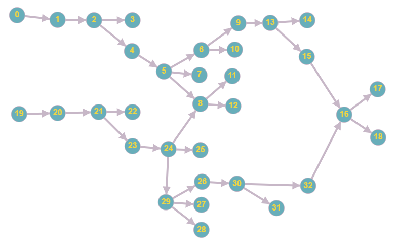

Abismus is an experimentation framework for running functions in a forest tree model.



This model mimics a "workflow" graph.

It aims to provide "projects" of graphs and functions to investigate properties of such functions or model existing algorithms on, and a GUI to help interact with such projects. These projects would be serialized to disk files.

The project creates an abstraction of function signatures in .NET to uniquely represent function signatures across delegates or different function implementations (out parameters vs. tuple return type, etc.). A positional hashing algorithm is used to provide an index number for each such signature. The execution engine tries to avoid dynamic dispatch (thus providing a measure of performance) by matching against such signature index numbers and calling typed delegates instead at runtime. A combinatorial approach is taken to select such delegate at runtime based on its signature. To produce these combinations, a code generation module inspects available signatures and continuously re-generates the delegate selection code.

Rendering the signature index permanent (i.e. unchanged across executions) is investigated by means of generating and persisting an index table. A generalization of an 'index space' is investigated to provide right-sized spaces for indexes for arbitrary properties of objects. This is currently only in the beginning.

It is hoped an application of the graph of functions is to analyze behavior of discrete finite systems, or produce representations by means of graphs of functions and fixed inputs.

Here is an example from the tests suite:

```
var node1 = new Node((Dels.O<int>)Funcs.Fixed);
var node2 = new Node((Dels.OFromO<int>)Funcs.Mirror);
var node3 = new Node((Dels.OOFromO<int>)Funcs.Duplicate);
var node4 = new Node((Dels.OFromOO<int>)Funcs.Mult);
var hs = new HashSet<Edge<Node>>();
hs.Add(new Edge<Node>(node1, node2));
hs.Add(new Edge<Node>(node2, node3));
hs.Add(new Edge<Node>(node3, node4));
var tree = hs.Tree(hs.First());
int final = tree.GetFinalValue<int>();
Assert.AreEqual(25, final);
```
